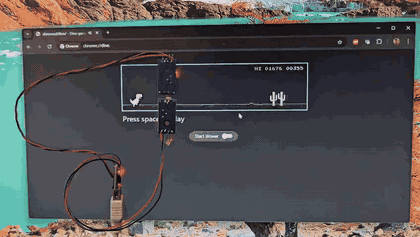
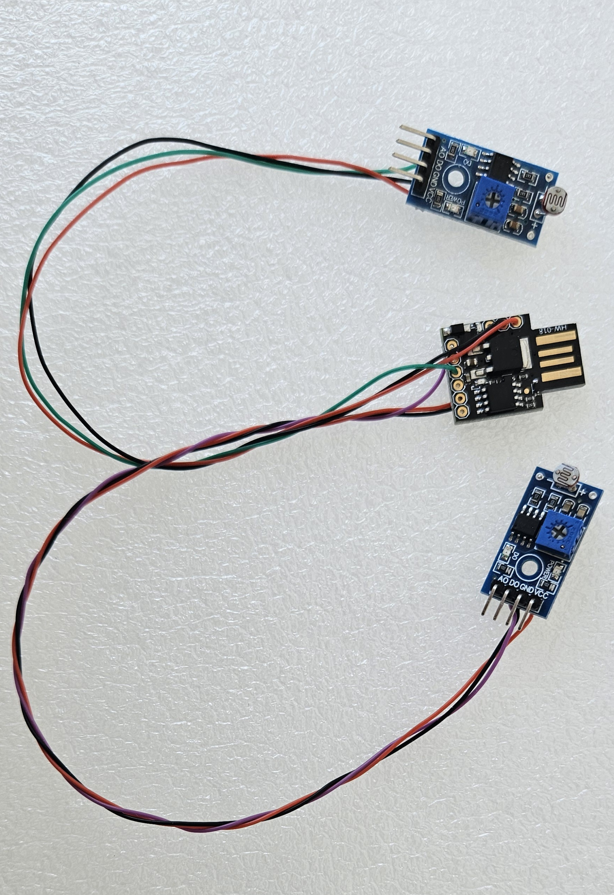

# Chrome Dino Auto-Player





A tiny USB dongle that plays the Chrome dinosaur game automatically. It plugs
into any PC, appears as a standard USB keyboard, detects obstacles on the
monitor using light sensors, and sends jump/duck keystrokes with
speed-adaptive timing. No drivers, no host software, no mechanical parts.

```
  Monitor
  ┌──────────────────────────────────────────┐
  │            Chrome Dino Game              │
  │                                          │
  │                        [Upper LDR]  ██   │
  │  🦖                   [Lower LDR] ████  │
  │▓▓▓▓▓▓▓▓▓▓▓▓▓▓▓▓▓▓▓▓▓▓▓▓▓▓▓▓▓▓▓▓▓▓▓▓▓▓▓▓  │
  └──────────────────────────────────────────┘
                            │  │
         Upper LDR D0 ──────┘  └────── Lower LDR D0
              │                              │
              │    DigiSpark ATtiny85        │
              │    ┌────────────────┐        │
              └───►│ PB0        USB ├──► PC  │
                   │                │        │
              ┌───►│ PB2         5V ├──► LM393 VCC (both)
              │    │            GND ├──► LM393 GND (both)
              │    └────────────────┘
              │
              └──── Lower LDR D0
```

## How It Works

1. **Plug in** the DigiSpark — it enumerates as a USB HID keyboard called "DinoPlayer"
2. Open `chrome://dino` (or disconnect from the internet)
3. After a 5-second startup delay, the device sends **spacebar** to start the game
4. Two LDR sensors mounted on the monitor detect obstacles and the device
   automatically sends **spacebar** (jump) or **down arrow** (duck)

## Concept

### Why This Approach?

Existing Chrome dino bots fall into three categories:

| Approach | Drawback |
|---|---|
| JavaScript injection | Requires browser access, detectable |
| Arduino + servo/solenoid | Bulky, noisy, mechanical wear |
| Arduino + serial + Python script | Requires host software running |

This project takes a different approach: a **self-contained USB dongle** that
appears as a keyboard. The host PC sees nothing but a keyboard plugging in and
pressing keys. No software installation, no browser extensions, works on any
OS, completely transparent to the system.

### Obstacle Detection with Dual Vertical Sensors

Two LM393 LDR comparator modules are mounted **vertically stacked** on the
monitor, at the same horizontal position, a few centimeters ahead of the
dinosaur:

```
  Monitor surface
  ┌──────────────────────────────┐
  │                              │
  │      [Upper LDR] ← bird      │
  │                              │
  │  🦖  [Lower LDR] ← cactus   │
  │▓▓▓▓▓▓▓▓▓▓▓▓▓▓▓▓▓▓▓▓▓▓▓▓▓▓▓▓  │
  └──────────────────────────────┘
```

The Chrome dino game has two types of obstacles:

- **Cacti** — appear at ground level (short and tall variants, sometimes in groups)
- **Pterodactyls (birds)** — fly at three heights: low, medium, and high

The two vertically-stacked sensors produce four possible states that map
cleanly to the correct action:

| Lower | Upper | Obstacle | Action |
|---|---|---|---|
| triggers | triggers | Tall cactus | JUMP (spacebar) |
| triggers | — | Short cactus or low bird | JUMP (spacebar) |
| — | triggers | Medium/high bird | DUCK (down arrow) |
| — | — | Clear ground | (nothing) |

The simplified decision rule:

- **Upper triggers WITHOUT lower** → DUCK (down arrow)
- **Any other trigger** → JUMP (spacebar)

This works because cacti always have dark pixels at ground level (lower sensor
fires), while birds flying at medium/high altitude only have pixels at the
upper sensor's height.

### Speed-Adaptive Jump Timing via Pulse-Width Envelope

The game accelerates over time. A fixed jump delay would either be too early
(at slow speed) or too late (at high speed). Instead of using a third sensor
for speed measurement, the firmware measures the **envelope width** — how long
each obstacle takes to pass the lower sensor.

A single small cactus has a fixed pixel width. At any speed, the time it takes
to pass the sensor is inversely proportional to game speed:

```
envelope_width = pixel_width / game_speed
```

#### Handling Fork-Shaped Cacti

Cacti are fork-shaped sprites, not solid blocks. A single cactus can produce
multiple sub-pulses as the sensor sees gaps between the forks:

```
Solid block:     ████████████
                  one clean pulse

Forked cactus:   ██ ██ ███
                  three pulses with gaps
```

The firmware uses a **gap threshold** (30ms) to merge these sub-pulses into a
single envelope. If the sensor goes clear but re-triggers within 30ms, it's
treated as the same obstacle:

```
Pin state:  ───██─██─███──────────
               |  gaps  |
               |________|
               envelope width
            first LOW    clear > 30ms
```

#### Handling Cactus Groups

Cacti sometimes appear in clusters. A group of cacti produces a wider envelope
than a single cactus at the same speed. To get a clean speed signal, the
firmware tracks a **rolling minimum** over the last 5 envelopes. The minimum
naturally corresponds to the single small cactus (the narrowest, most
consistent reference):

```
Recent envelopes: [90ms, 55ms, 40ms, 45ms, 90ms]
Rolling min = 40ms → reliable speed reference

As game speeds up:
  Early game:   min ≈ 40ms → longer jump delay
  Mid game:     min ≈ 25ms → medium delay
  Late game:    min ≈ 15ms → short delay
```

The jump delay is computed as:

```
jump_delay = clamp(rolling_min * scale_factor, MIN_DELAY, MAX_DELAY)
```

## Architecture

### Hardware

- **MCU**: ATtiny85 on DigiSpark board (8KB flash, 512B SRAM)
- **USB**: V-USB software USB stack (low-speed HID keyboard)
- **Sensors**: 2x LM393 LDR comparator modules with adjustable threshold potentiometers
- **Power**: USB bus powered (5V, <100mA)
- **Bootloader**: Micronucleus (USB bootloader, no external programmer needed)

### Pin Assignment

```
                     +-\/-+
        A0 (D5) PB5  1|    |8  Vcc
  USB-  A3 (D3) PB3  2|    |7  PB2 (D2) ← Lower sensor (cactus height)
  USB+  A2 (D4) PB4  3|    |6  PB1 (D1) --- (free)
                GND  4|    |5  PB0 (D0) ← Upper sensor (bird height)
                     +----+
```

- **PB3, PB4**: Reserved for USB D-/D+ (V-USB)
- **PB2**: Lower LM393 sensor (digital input, cactus detection + speed measurement)
- **PB0**: Upper LM393 sensor (digital input, bird detection)
- **PB1**: Free (available for future use, e.g., status LED)
- **PB5**: Reset pin (kept as reset for reprogramming)

### Wiring

```
Lower LM393 Board       DigiSpark
  VCC  ────────────────  5V
  GND  ────────────────  GND
  D0   ────────────────  PB2 (Pin 2)

Upper LM393 Board       DigiSpark
  VCC  ────────────────  5V
  GND  ────────────────  GND
  D0   ────────────────  PB0 (Pin 0)
```

Both LM393 boards share 5V and GND from the DigiSpark.

### Firmware Flow

```
                    ┌──────────────┐
                    │  USB Init    │
                    │  Enumerate   │
                    │  as keyboard │
                    └──────┬───────┘
                           │
                    ┌──────▼───────┐
                    │ Startup delay│
                    │   (5 sec)    │
                    └──────┬───────┘
                           │
                    ┌──────▼───────┐
                    │ Send SPACE   │
                    │ (start game) │
                    └──────┬───────┘
                           │
               ┌───────────▼───────────┐
               │   Main Loop (~1ms)    │◄─────────────────┐
               │                       │                  │
               │  Read Lower (PB2)     │                  │
               │  Read Upper (PB0)     │                  │
               └───────────┬───────────┘                  │
                           │                              │
                    ┌──────▼───────┐                      │
                    │  In cooldown?│──yes─────────────────┤
                    └──────┬───────┘  (track envelope     │
                           │no        but skip action)    │
                           │                              │
               ┌───────────▼───────────┐                  │
               │  Envelope tracking    │                  │
               │  (lower sensor)       │                  │
               │  - merge fork gaps    │                  │
               │  - record width       │                  │
               │  - update rolling min │                  │
               └───────────┬───────────┘                  │
                           │                              │
               ┌───────────▼───────────┐                  │
               │  Obstacle detected?   │──no──────────────┤
               └───────────┬───────────┘                  │
                           │yes                           │
                           │                              │
               ┌───────────▼───────────┐                  │
               │  Upper only?          │                  │
               │  ├─ yes → DUCK (↓)    │                  │
               │  └─ no  → JUMP (⎵)    │                  │
               │                       │                  │
               │  Delay = adaptive     │                  │
               │  (from rolling min)   │                  │
               │                       │                  │
               │  Send keystroke       │                  │
               │  Start cooldown       │                  │
               └───────────────────────┘──────────────────┘
```

### Software Stack

```
┌─────────────────────────────────┐
│  Application Logic (main.c)     │  Sensor polling, obstacle classification,
│  - Dual sensor detection        │  envelope measurement, adaptive delay,
│  - Speed-adaptive timing        │  keystroke generation
│  - Envelope measurement         │
├─────────────────────────────────┤
│  V-USB Driver (usbdrv/)         │  Software USB 1.1 low-speed implementation
│  - HID Keyboard report          │  for AVR microcontrollers. Bit-bangs the
│  - Boot protocol compliant      │  USB protocol on PB3/PB4 using interrupts.
├─────────────────────────────────┤
│  AVR Hardware (ATtiny85)        │  8-bit MCU @ 16.5MHz (internal RC osc),
│  - GPIO digital input           │  calibrated against USB frame timing.
│  - Watchdog timer               │
└─────────────────────────────────┘
```

### USB HID Details

The device enumerates as a standard boot-protocol keyboard:

- **VID/PID**: `0x16c0` / `0x27dc`
- **Device name**: "DinoPlayer"
- **Manufacturer**: "digistump.com"
- **HID report**: Standard 8-byte keyboard report (modifier + reserved + 6 keys)
- **Poll interval**: 10ms

Key codes sent:
- `0x2C` — Spacebar (jump over cacti)
- `0x51` — Down Arrow (duck under birds)

## Building

### Prerequisites

- `avr-gcc` toolchain (`apt install gcc-avr avr-libc`)
- `libusb-1.0-dev` (for micronucleus uploader)
- `pkg-config`

### Build Firmware

```bash
make hex          # compile firmware only
make all          # compile firmware + micronucleus uploader
```

### Flash to DigiSpark

```bash
make upload       # builds everything, then prompts to plug in DigiSpark
```

The micronucleus bootloader activates for ~5 seconds when the DigiSpark is
first plugged in. Run `make upload`, then plug in the board when prompted.

### Other Targets

```bash
make flash        # flash via ISP programmer (avrdude)
make fuse         # program fuse bits (requires ISP)
make clean        # remove build artifacts
make help         # show all targets
```

## Tunable Parameters

All tuning constants are `#define`s at the top of `src/main.c`:

| Parameter | Default | Description |
|---|---|---|
| `OBSTACLE_IS_LOW` | `1` | Sensor polarity: 1 = obstacle triggers LOW on D0 |
| `STARTUP_DELAY` | `5000` | Milliseconds before sending first spacebar |
| `KEY_HOLD_MS` | `80` | How long spacebar is held (jump height) |
| `DUCK_HOLD_MS` | `200` | How long down-arrow is held (duck duration) |
| `COOLDOWN_MS` | `400` | Minimum gap between actions |
| `GAP_THRESHOLD_MS` | `30` | Max gap within one obstacle envelope |
| `ENVELOPE_HISTORY` | `5` | Rolling window size for speed estimation |
| `MIN_JUMP_DELAY` | `10` | Floor for adaptive jump delay (ms) |
| `MAX_JUMP_DELAY` | `150` | Ceiling for adaptive jump delay (ms) |
| `DEFAULT_JUMP_DELAY` | `50` | Jump delay before any envelopes measured |

## Sensor Calibration

1. Mount both LDR sensors on the monitor with the game running
2. Position the **lower sensor** at cactus height (mid-ground area)
3. Position the **upper sensor** at bird flight height (above the cactus zone)
4. Both sensors should be at the **same horizontal position**, a few cm to the
   right of the dinosaur character
5. Adjust each LM393 **potentiometer** until:
   - The onboard LED turns ON for white background (no obstacle)
   - The LED turns OFF when a dark obstacle passes
6. If your LM393 board has inverted output (LED OFF for bright), set
   `OBSTACLE_IS_LOW` to `0` in `src/main.c`

## Firmware Size

```
Phase 2 (dual sensor + adaptive speed):
   text    data     bss     dec     hex
   2620       2      77    2699     a8b
```

2699 bytes total — well within the ATtiny85's ~6KB available flash
(after micronucleus bootloader).

## Disabling Day/Night Mode

The game alternates between day mode (white background, dark obstacles) and
night mode (dark background, light obstacles) approximately every 700 points.
This background color change causes false sensor triggers because the LDR
sensors interpret the entire dark background as one giant obstacle.

**Workaround**: Disable the day/night cycling via Chrome DevTools:

1. Open `chrome://dino` and press `Ctrl+Shift+I` to open DevTools
2. Go to the **Console** tab
3. Start the game (press spacebar)
4. Paste and run:

```javascript
Runner.getInstance().invert = function(reset) {};
```

This overrides the inversion function with a no-op, keeping the game
permanently in day mode. The sensors work reliably in day mode since
obstacles are dark on a white background with good contrast.

**Note**: This must be run after each game restart, as the function is
reset when the game reloads.

## Known Limitations

- **Day/night mode (without workaround)**: If the console workaround above
  is not applied, the game's night mode will cause false triggers. A future
  firmware update may detect the mode switch and flip sensor polarity at
  runtime automatically.
- **LDR response time**: LDR photoresistors have a ~10-50ms response time.
  Phototransistors would provide faster (<1ms) response but the LM393
  comparator modules are more readily available and sufficient for the
  game's speed range.

## Project Structure

```
chrome-dinoplayer/
├── Makefile                 AVR-GCC build system
├── PLAN.md                  Detailed design document
├── README.md                This file
├── hex/
│   └── dino-player-v1.hex   Pre-built firmware image
├── src/
│   ├── main.c               Application firmware
│   └── usbconfig.h          V-USB configuration for HID keyboard
├── tools/
│   └── micronucleus/        USB bootloader upload tool
└── usbdrv/                  V-USB driver (software USB for AVR)
```

## License

See [LICENSE](LICENSE).
